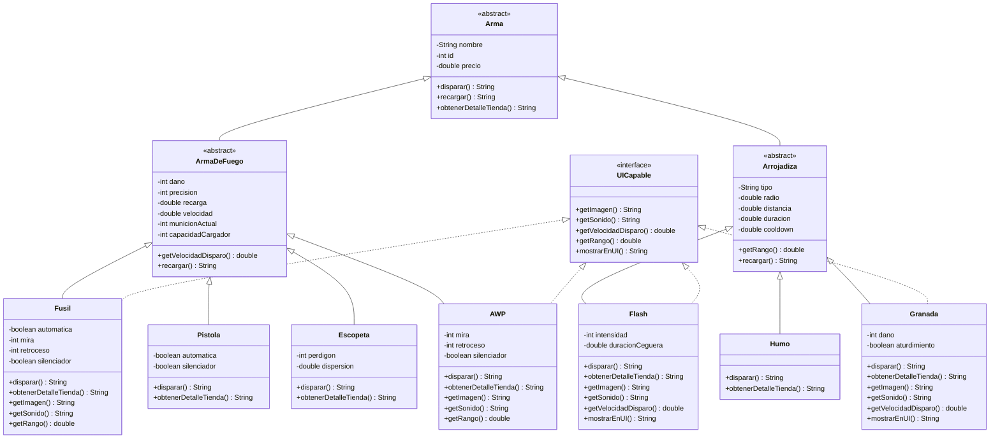

```mermaid
classDiagram
    %% Clase Base
    class Arma {
        <<abstract>>
        -String nombre
        -int id
        -double precio
        +disparar() String
        +recargar() String
        +obtenerDetalleTienda() String
    }

    %% Clases Intermedias (heredan de Arma)
    class ArmaDeFuego {
        <<abstract>>
        -int dano
        -int precision
        -double recarga
        -double velocidad
        -int municionActual
        -int capacidadCargador
        +getVelocidadDisparo() double
        +recargar() String
    }

    class Arrojadiza {
        <<abstract>>
        -String tipo
        -double radio
        -double distancia
        -double duracion
        -double cooldown
        +getRango() double
        +recargar() String
    }

    %% Interfaz compartida entre familias
    class UICapable {
        <<interface>>
        +getImagen() String
        +getSonido() String
        +getVelocidadDisparo() double
        +getRango() double
        +mostrarEnUI() String
    }

    %% Clases Finales (heredan de las intermedias)
    class Fusil {
        -boolean automatica
        -int mira
        -int retroceso
        -boolean silenciador
        +disparar() String
        +obtenerDetalleTienda() String
        +getImagen() String
        +getSonido() String
        +getRango() double
    }

    class Pistola {
        -boolean automatica
        -boolean silenciador
        +disparar() String
        +obtenerDetalleTienda() String
    }

    class Escopeta {
        -int perdigon
        -double dispersion
        +disparar() String
        +obtenerDetalleTienda() String
    }

    class AWP {
        -int mira
        -int retroceso
        -boolean silenciador
        +disparar() String
        +obtenerDetalleTienda() String
        +getImagen() String
        +getSonido() String
        +getRango() double
    }

    class Flash {
        -int intensidad
        -double duracionCeguera
        +disparar() String
        +obtenerDetalleTienda() String
        +getImagen() String
        +getSonido() String
        +getVelocidadDisparo() double
        +mostrarEnUI() String
    }

    class Humo {
        +disparar() String
        +obtenerDetalleTienda() String
    }

    class Granada {
        -int dano
        -boolean aturdimiento
        +disparar() String
        +obtenerDetalleTienda() String
        +getImagen() String
        +getSonido() String
        +getVelocidadDisparo() double
        +mostrarEnUI() String
    }

    %% Relaciones de herencia
    Arma <|-- ArmaDeFuego
    Arma <|-- Arrojadiza

    ArmaDeFuego <|-- Fusil
    ArmaDeFuego <|-- Pistola
    ArmaDeFuego <|-- Escopeta
    ArmaDeFuego <|-- AWP

    Arrojadiza <|-- Flash
    Arrojadiza <|-- Humo
    Arrojadiza <|-- Granada

    %% Implementación de la interfaz compartida
    UICapable <|.. Fusil
    UICapable <|.. Flash
    UICapable <|.. AWP
    UICapable <|.. Granada
```
