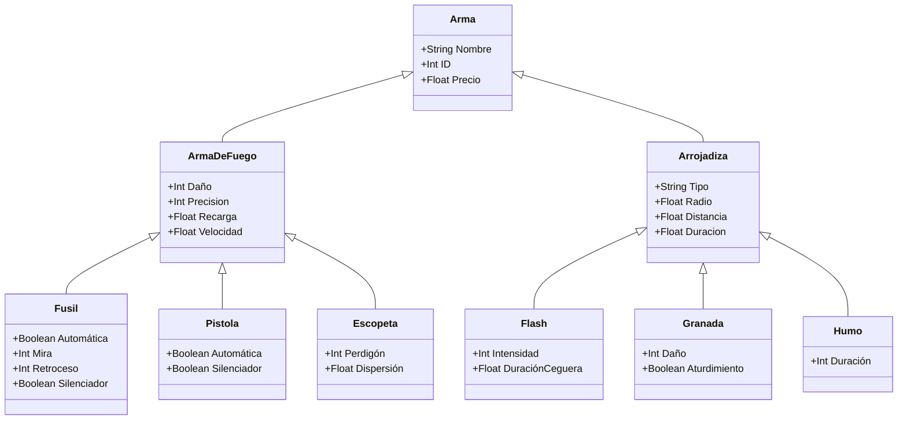

# mmedina-tplp3-2026
# Diagrama Mermaid

```mermaid
classDiagram
    %% Clase Base
    class Arma {
        +String Nombre
        +Int ID
        +Float Precio
    }

    %% Clases Intermedias (Heredan de Arma)
    class ArmaDeFuego {
        +Int Daño
        +Int Precision
        +Float Recarga
        +Float Velocidad
    }

    class Arrojadiza {
        +String Tipo
        +Float Radio
        +Float Distancia
        +Float Duracion
    }

    %% Clases Finales (Heredan de las Intermedias)
    class Fusil {
        +Boolean Automática
        +Int Mira
        +Int Retroceso
        +Boolean Silenciador
    }

    class Pistola {
        +Boolean Automática
        +Boolean Silenciador
    }

    class Escopeta {
        +Int Perdigón
        +Float Dispersión
    }

    class Flash {
        +Int Intensidad
        +Float DuraciónCeguera
    }

    class Granada {
        +Int Daño
        +Boolean Aturdimiento
    }

    class Humo {
        +Int Duración
    }

    %% Relaciones de Herencia
    Arma <|-- ArmaDeFuego
    Arma <|-- Arrojadiza

    ArmaDeFuego <|-- Fusil
    ArmaDeFuego <|-- Pistola
    ArmaDeFuego <|-- Escopeta

    Arrojadiza <|-- Flash
    Arrojadiza <|-- Granada
    Arrojadiza <|-- Humo
```
