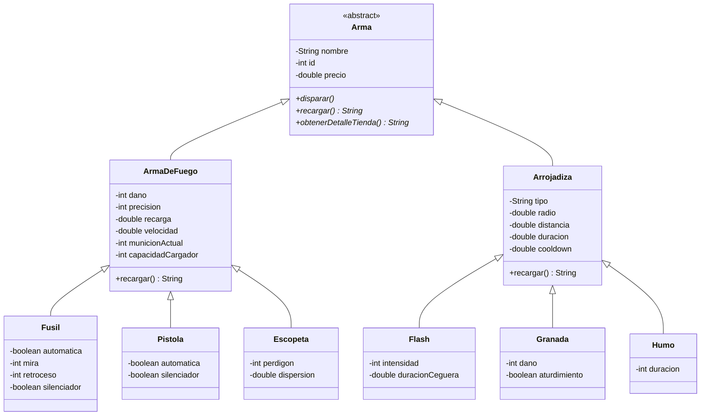

# mmedina-tplp3-2026

Proyecto Java / Spring Boot del dominio Counter-Strike 2 desarrollado para la materia Lenguajes de Programación 3 (Universidad Católica "Nuestra Señora de la Asunción").

## Licencia
Este proyecto se distribuye bajo la licencia **Apache License 2.0**. Para más detalles, consulte el archivo `LICENSE` en la raíz del repositorio.

---

## Diagrama de Clases (Mermaid)



---

## Cambios en POO-06: Sobrecarga y Sobreescritura

### 1. Sobrecarga (Overloading)
La **sobrecarga** se implementó en la capa de dominio (`py.edu.uc.lp3.mm.cs2.domain`) mediante la definición de múltiples constructores dentro de la misma clase con distinto número y tipo de parámetros:
* **Constructores Simples (Vacíos):** Permiten instanciar un objeto predeterminado sin valores iniciales asignados de forma obligatoria.
* **Constructores Sobrecargados Parciales:** Facilitan la instanciación rápida pasando únicamente atributos básicos (`nombre`, `id` y `precio`).
* **Constructores Sobrecargados Completos:** Reciben la totalidad de los parámetros de la entidad y de sus clases ancestras, reutilizando código mediante la invocación a `super(...)`.

Ejemplo aplicado en `Fusil` y `Flash`:
```java
public Fusil() { ... }
public Fusil(String nombre, int id, double precio) { ... }
public Fusil(String nombre, int id, double precio, int dano, ...) { ... }
```

### 2. Sobreescritura (Overriding)
La **sobreescritura** (`@Override`) permite redefinir en las clases hijas métodos abstractos o concretos declarados en las superclases, adaptando el comportamiento al tipo específico de objeto en tiempo de ejecución:
* El método abstracto `recargar()` definido en la clase padre `Arma` es redefinido de forma particular en las clases intermedias (`ArmaDeFuego`, `Arrojadiza`) y clases concretas (`Fusil`, `Flash`).
* Esto permite el uso de **polimorfismo dinámico** en los controladores REST (`ArmaController`), donde se pueden tratar distintas armas bajo la referencia del tipo abstracto `Arma` y ejecutar `recargar()` con el comportamiento exacto de cada subclase.

---

## Enlace al Commit de la Solución
* **Commit:** `https://github.com/MigueMedina/mmedina-tplp3-2026/commit/4bb80ea`
```
